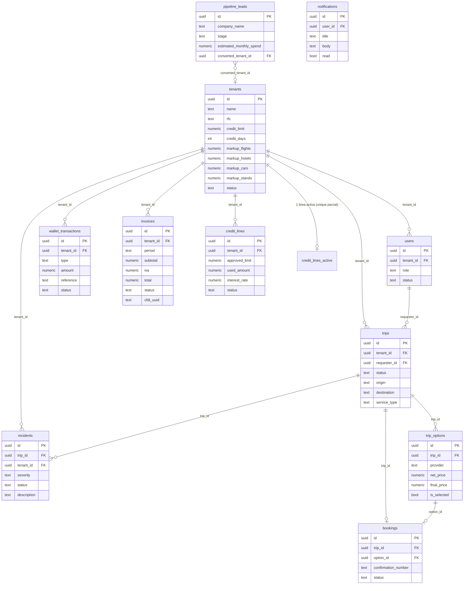

# Arquitectura de TORA

## Visión general

- Plataforma **multi-tenant B2B** de gestión de viajes corporativos (mercado mexicano).
- **Next.js 15 (App Router)** + TypeScript + Tailwind v4 + shadcn/ui. Server Components por defecto; Client Components solo para interacción (dialogs, filtros, Kanban).
- **Supabase**: Postgres + Auth (email/password) + Storage + Row Level Security.
- Mutaciones de negocio a través de **RPCs transaccionales** (`security definer`) — nunca del cliente admin (`service_role`) desde la app.
- Middleware de Next.js resuelve sesión + rol y enrutiza a 4 portales: CLIENT, OPS, FINANCE, ADMIN.

```
Navegador ──► middleware.ts (sesión + rol + RLS-aware redirects)
                │
                ├─ (auth)/        login · register · pending
                ├─ (client)/      dashboard · trips · wallet · invoices
                ├─ (ops)/         inbox · trips + Quote Builder · incidents · clients
                ├─ (finance)/     deposits · dashboard · credit · invoices
                └─ (admin)/       tenants · users · pipeline · invoices
                │
                ▼
        Server Components / Server Actions ──► Supabase (PostgREST + RPCs + Storage)
```

## Infraestructura operativa

```
┌────────────┐ SES + RLS        ┌──────────────────────┐
│  Vercel    │─────────────────►│  Supabase            │
│  Next 15   │  service key     │  Postgres · Auth     │
│  (TORA)    │◄─────────────────│  Storage · pg_cron   │
└─┬─────┬────┘                  └──────────────────────┘
  │     │ errores server+client        ▲
  │     ▼                              │ RPC diaria 03:00 CDMX
  │  ┌──────────┐                      │ (interés de mora)
  │  │ Sentry   │               ───────┘
  │  └──────────┘
  │  webhook WhatsApp      ┌───────────────────────┐
  └─►(POST /api/whatsapp/  │  WAHA (Railway)       │
      webhook) ──────────► │  sesión tora-prod     │
                           │  engine WEBJS         │
                           └───────────────────────┘
```

| Pieza | Servicio | Detalle |
|---|---|---|
| App | Vercel | `tora-eta.vercel.app`; deploy manual `vercel --prod` desde `main` |
| Datos/Auth/Storage | Supabase | RLS por tenant; RPCs `security definer` para dinero |
| WhatsApp | WAHA en Railway | `lib/whatsapp/client.ts` con timeout 10 s y graceful degradation; opt-in LFPDPPP (`docs/WHATSAPP.md`) |
| Errores | Sentry | client + server (`instrumentation.ts` + `onRequestError`); sampleo 10% de traces; scrub de cookies/authorization |
| Cron de mora | `pg_cron` (Supabase) | aplica interés diario sobre trips de crédito vencidos |
| Health | `GET /api/health` | ping a DB (latencia) + tenants activos; `503` si la base no responde — listo para UptimeRobot |

## Diagrama de tablas



## Roles y permisos

| Rol | Portal | Acceso principal |
|---|---|---|
| `CLIENT_ADMIN` | client | Su tenant: trips, wallet, facturas propias; selecciona opciones (RPC) |
| `CLIENT_FINANCE` | client | Wallet y facturas propias (solo lectura + upload de comprobantes) |
| `TORA_OPS` | ops | Todos los trips de todos los tenants; cotiza (Quote Builder); incidentes |
| `TORA_FINANCE` | finance | Depósitos de todos los tenants; líneas de crédito; facturas cross-tenant |
| `TORA_ADMIN` | admin | Todo lo anterior + tenants, usuarios (activación), pipeline, facturas |

## RLS

Helpers SQL (`security definer`, ejecutables por las policies):

- `get_user_role()` → rol del `auth.uid()` desde `public.users`.
- `get_user_tenant_id()` → tenant del usuario (NULL para staff TORA interno).
- `is_tora_staff()` → `true` para `TORA_OPS` / `TORA_FINANCE` / `TORA_ADMIN`.
- `handle_new_user()` → trigger `on_auth_user_created`: crea fila en `public.users` con `status='pending_approval'`, `tenant_id=NULL`; sincroniza consentimientos legales (0009, 0024) y preferencias WhatsApp (0022).
- `set_updated_at()` → trigger de `updated_at` (invocada solo por triggers, sin grants).

| Tabla | CLIENT_* | TORA_OPS | TORA_FINANCE | TORA_ADMIN |
|---|---|---|---|---|
| `tenants` | select propio | select todas | select todas | all |
| `users` | select propios | — | — | all |
| `trips` | all propios | all (staff) | select (staff) | all (staff) |
| `trip_options` | select propios | all (staff) | select (staff) | all (staff) |
| `bookings` | select propios | select (staff) | select (staff) | all (staff) |
| `wallet_transactions` | all propios | select (staff) | all (staff) | all (staff) |
| `credit_lines` | select propios | — | all (staff) | all (staff) |
| `invoices` | select propios | — | all (staff) | all (staff) |
| `incidents` | select propios | all (staff) | select (staff) | all (staff) |
| `support_tickets` | select/insert propios | — | — | all (staff) |
| `notifications` | all propios | all propias | all propias | all propias |
| `pipeline_leads` | — | — | — | all |

Nota: "staff" = `is_tora_staff()`; `TORA_ADMIN` hereda el acceso de `TORA_FINANCE` y `TORA_OPS` por pertenecer a `is_tora_staff()` y, además, tiene policies `all` dedicadas donde el módulo lo exige (`users`, `pipeline_leads`, updates de `tenants`).

## RPCs

| RPC | Rol requerido | Efecto |
|---|---|---|
| `select_trip_option(p_trip_id, p_option_id)` | `CLIENT_ADMIN` | Marca opción, crea charge y si el saldo alcanza: cobra + booking + `confirmed`; si no: `awaiting_payment` |
| `replace_trip_options(p_trip_id, p_options, p_send_to_client)` | `TORA_OPS`/`TORA_ADMIN` | Reemplaza opciones del trip (Quote Builder) y opcionalmente lo envía al cliente |
| `approve_deposit(p_transaction_id)` | `TORA_FINANCE`/`TORA_ADMIN` | Valida depósito SPEI, acredita wallet y **auto-confirma** los trips en `awaiting_payment` que queden cubiertos |
| `reject_deposit(p_transaction_id, p_reason)` | `TORA_FINANCE`/`TORA_ADMIN` | Rechaza comprobante con motivo |
| `approve_credit_for_trip(p_trip_id, p_new_limit?)` | `TORA_FINANCE`/`TORA_ADMIN` | Crea/ajusta línea de crédito, mueve el charge a `pending_payment` (30 días), crea booking y confirma el trip |
| `suspend_tenant(p_tenant_id)` | `TORA_FINANCE`/`TORA_ADMIN` | Suspende tenant con mora 90+ días |
| `activate_user(p_user_id, p_tenant_id, p_role)` | `TORA_ADMIN` | Activa registro pendiente (valida coherencia CLIENT_* ⇒ tenant) |
| `update_user_role(p_user_id, p_tenant_id, p_role)` | `TORA_ADMIN` | Cambia rol/tenant de un usuario activo |
| `toggle_user_status(p_user_id, p_new_status)` | `TORA_ADMIN` | Suspende/reactiva usuarios |
| `toggle_tenant_status(p_tenant_id, p_new_status)` | `TORA_ADMIN` | Activa/suspende/archiva tenants |
| `create_tenant(...)` | `TORA_ADMIN` | Alta de tenant (anti-duplicado por RFC, markups default) |
| `invite_user(p_email, ...)` | `TORA_ADMIN` | Crea `auth.users` + fila activa (patrón `crypt()`, sin cliente admin) |

## Flujos de negocio

- **Flujo A — Saldo (prepaid):** CLIENT_ADMIN crea trip → OPS cotiza (`replace_trip_options`) → trip `options_sent`/`awaiting_selection` → cliente selecciona (`select_trip_option`) → con saldo: cargo `completed` + booking `confirmed`.
- **Flujo B — SPEI:** cliente selecciona **sin saldo** → trip `awaiting_payment` + charge `pending` → cliente deposita y sube comprobante a Storage → TORA_FINANCE aprueba (`approve_deposit`) → wallet acreditado y **auto-confirmación** de los trips cubiertos.
- **Flujo C — Crédito:** igual que B hasta `awaiting_payment` → TORA_FINANCE aprueba crédito (`approve_credit_for_trip`) → línea de crédito creada/ajustada, charge `pending_payment` (mora: 0% a 30 días, 2.5%/mes 31–60, 3.5%/mes 61–90, suspensión 90+), booking `confirmed`. Liquidación: `settleCreditTrip` (Sprint 2) con due date calculada en hora CDMX (`lib/dates.ts`).
- **Flujo D — Registro → activación:** registro público (con aceptación de Términos y Aviso) → `handle_new_user` crea perfil `pending_approval` → middleware lo confina a `/pending` → TORA_ADMIN lo activa en `/admin/users` → login dirigido a su portal.

Verificación de cada flujo: `docs/ACCEPTANCE.md`.

## Storage

- **Bucket `receipts`** (privado): comprobantes SPEI. Path `{tenant_id}/{transaction_id}.pdf`. Policies: select al tenant dueño + staff; insert/update el dueño; validate por staff.
- **Bucket `invoices`** (privado): facturas PDF/XML. Path `{tenant_id}/{period}/{uuid}-factura.{pdf|xml}`. Policies: select al tenant dueño + staff; insert solo `TORA_ADMIN`/`TORA_FINANCE`.
- Las URLs se firman **en servidor** (`app/api/receipts/signed-url/route.ts`) para validar pertenencia antes de emitir el signed URL.

## Decisiones de diseño

- **¿Por qué RPCs en lugar de TS?** Las mutaciones de dinero (`select_trip_option`, `approve_deposit`, `approve_credit_for_trip`) exigen atomicidad y aislamiento ante carreras (dos aprobaciones concurrentes, doble selección). En Postgres, la transacción es el límite correcto; en TS habría que orquestar locks manuales y seguiríamos expuestos a TOCTOU. Además, `security definer` permite validar rol/tenant dentro del propio motor, sin confiar en el cliente.
- **¿Por qué `credit_lines` separada de `tenants`?** Un tenant puede tener historial de líneas (una cerrada, otra activa), cada línea audita `approved_by`/`approved_at`, y el unique parcial `WHERE status='active'` garantiza una sola línea activa por tenant.
- **¿Por qué `pipeline_leads` separada?** Los leads son datos de CRM pre-conversión: no cumplen las invariantes de `tenants` (RFC, markups, usuarios) y su ciclo de vida es distinto. `converted_tenant_id` deja trazable la conversión sin mezclar modelos.
- **¿Por qué severidad de incidentes en el server?** `calculateSeverity` (`lib/business/incidents.ts`) es la única fuente: la server action la recalcula y la UI solo la muestra en vivo — el cliente no puede mandar una severidad arbitraria.
- **¿Por qué RPCs con timeout?** `rpcWithTimeout` (`lib/supabase/rpc-with-timeout.ts`, 10 s, `AbortController`) evita que una pausa de Postgres deje colgadas las server actions de dinero; el usuario recibe un error accionable en vez de un spinner eterno.

## Fase 2 — Backlog

- **Facturación electrónica (Facturapi):** hoy el export JSON manual (`lib/business/invoice-export.ts`) alimenta al contador; Fase 2 integra la API para timbrado directo.
- **Monorepo (next-forge):** `apps/app`, `packages/ui`, `packages/database`, `packages/auth`, `packages/business`. El design system ya está aislado (`components/ui` + tokens en `globals.css` + `lib/motion`).
- **Notificaciones:** envío idempotente (dedupe por evento) y job de reintento de WhatsApp fallidos cuando la sesión WAHA vuelva a WORKING.
- **Otros:** Google OAuth, conciliación bancaria automática, drag-and-drop del pipeline (dnd-kit), MFA obligatorio para staff, PWA offline-first.
